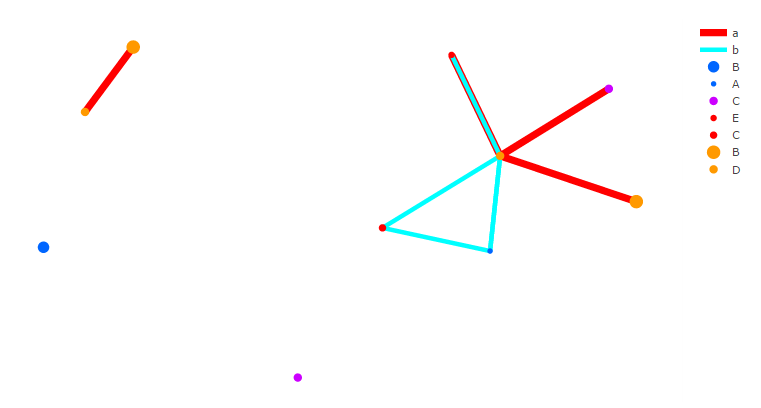
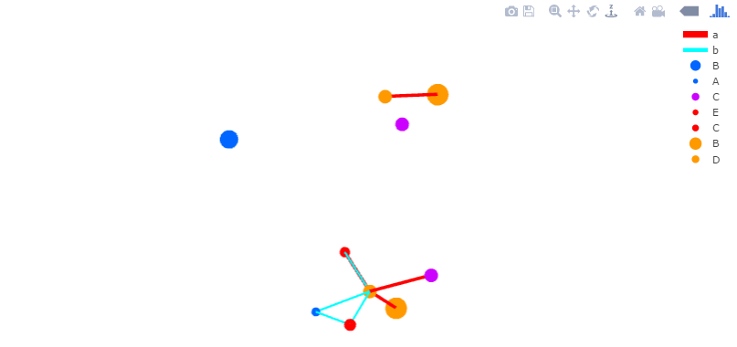

# Description
## Network visualization using [Plotly](https://github.com/ropensci/plotly).

# Install

```r
devtools::install_github("dgrapov/networkly")
```

# Examples
## Create network `Edge List` and `Node Attributes`

```r
#set up network structure
conn<-1 # average number of conenctions per variable
nodes<-10 # number of variables
net_size<-conn*nodes
edge_type<-2 # number of diffrent connections


#color/size
set.seed(555)
id<-factor(sample(1:edge_type,net_size,replace = TRUE))
id2<-factor(sample(1:10,nodes,replace = TRUE))

edge.list<-data.frame(source=sample(1:nodes,net_size,replace=TRUE),
                      target=sample(1:nodes,net_size,replace=TRUE),
                      color=rainbow(edge_type)[id],
                      size=sample(seq(1,10,length.out=10),edge_type,replace=TRUE)[id],
                      names=letters[id],stringsAsFactors = FALSE)
node.data<-data.frame(color=sample(rainbow(10),nodes,replace=TRUE)[id2],
                      size=sample(seq(5,15,length.out=10),nodes,replace=TRUE)[id2],
                      names=sample(LETTERS[1:5],nodes,replace=TRUE)[id2],stringsAsFactors = FALSE)
```
## `Edge List` describing network connections

```r
head(edge.list)
```

```
##   source target     color size names
## 1      4      5 #FF0000FF    8     a
## 2      1      3 #00FFFFFF    5     b
## 3      3      7 #00FFFFFF    5     b
## 4      3      3 #00FFFFFF    5     b
## 5      2      3 #00FFFFFF    5     b
## 6      6      3 #FF0000FF    8     a
```

## `Node Attributes` describing variables

```r
head(node.data)
```

## Create 2D network

```r
library(networkly)
library(plotly)
layout<-"fruchtermanreingold" #see networkly::get_network for 2D and 3D options

#net params
type<-"2d"
color<-'color'
size<-'size'
name<-'names'

#create network objects
obj<-get_network(edge.list,type=type,layout=layout)
net<-c(get_edges(obj,color=color,width=size,name=name,type=type,hoverinfo="none",showlegend=FALSE),get_nodes(obj,node.data,color=color,size=size,name=name,type=type,hoverinfo="name",showlegend=FALSE))

#add legend
legend<-format_legend(obj,node.data=node.data)

net<-c(net,c(get_edges(legend,color=color,width=size,name=name,type=type,hoverinfo="none",showlegend=TRUE),get_nodes(legend,node.data=legend$node.data,color=color,size=size,name=name,type=type,hoverinfo="name",showlegend=TRUE)))


net<-shiny_ly(net) # works in or out of shiny

#add layout options
layout(net,
       xaxis = list(title = "", showgrid = FALSE, showticklabels = FALSE, zeroline = FALSE, hoverformat = '.2f'),
       yaxis = list(title = "", showgrid = FALSE, showticklabels = FALSE, zeroline = FALSE, hoverformat = '.2f'))
```



### [See live graph](http://dgrapov.github.io/networkly/).

## Create 3D network

```r
#net params
type<-"3d"

#create network objects
obj<-get_network(edge.list,type=type,layout=layout)
net<-c(get_edges(obj,color=color,width=size,name=name,type=type,hoverinfo="none",showlegend=FALSE),get_nodes(obj,node.data,color=color,size=size,name=name,type=type,hoverinfo="name",showlegend=FALSE))

#add legend
legend<-format_legend(obj,node.data=node.data)

net<-c(net,c(get_edges(legend,color=color,width=size,name=name,type=type,hoverinfo="none",showlegend=TRUE),get_nodes(legend,node.data=legend$node.data,color=color,size=size,name=name,type=type,hoverinfo="name",showlegend=TRUE)))


net<-shiny_ly(net) 

#add layout options
layout(net,
         scene = list(showlegend=TRUE,
                      yaxis=list(showgrid=FALSE,showticklabels=FALSE,zeroline=FALSE,title=""),
                      xaxis=list(showgrid=FALSE,showticklabels=FALSE,zeroline=FALSE,title=""),
                      zaxis=list(showgrid=FALSE,showticklabels=FALSE,zeroline=FALSE,title="")))
```



### [See live graph](http://dgrapov.github.io/networkly/).

## Shiny
## `ui.R`

```r
shinyUI(bootstrapPage(
    plotlyOutput("network")
))
```
## `server.R` 

```r
shinyServer(function(session,input, output) {
  output$network<-renderPlotly({
    #network creation script goes here
    #see above for how to create 2d or 3d networks
    shiny_ly(net)
  })
})
```
## Run Demo App

```r
networklyShiny()
```

## Limitations
#### To allow edge widths in 2D and 3D networks and to properly render edge paths in 3D networks each edge element is an independent list item. The shown edge and node legends are place holders which do not correctly show or hide components. This can be changed during the network creation procces by using `showlegend=TRUE` and not creating a place holder legend as shown below. For 2D networks edge segments can be renderd from a vector with intermittent NAs e.g. `x/y/z = source1 target1 NA source2 target2` this currently does not work for 3D networks. Basic 2D networks can instead be created from ggplot networks using `plotly::ggplotly`.

```r
net<-c(get_edges(obj,color=color,width=size,name=name,type=type,hoverinfo="none",showlegend=TRUE),get_nodes(obj,node.data,color=color,size=size,name=name,type=type,hoverinfo="name",showlegend=TRUE))
shiny_ly(net)
```

## About
### updated 2016-02-28


